Gallery
====================
| **Dimensions** | | |
| :---: | :---: | :---: |
|  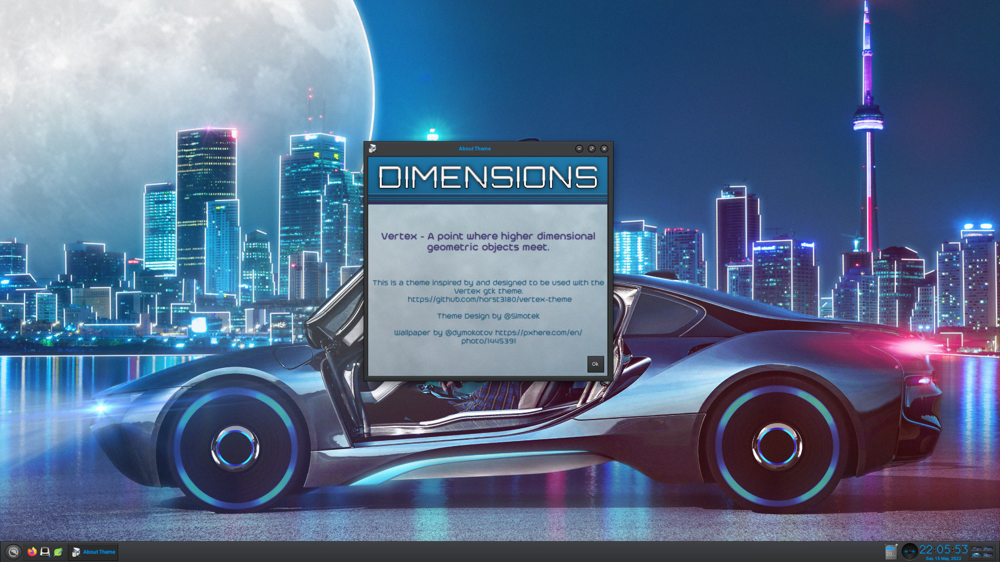  |  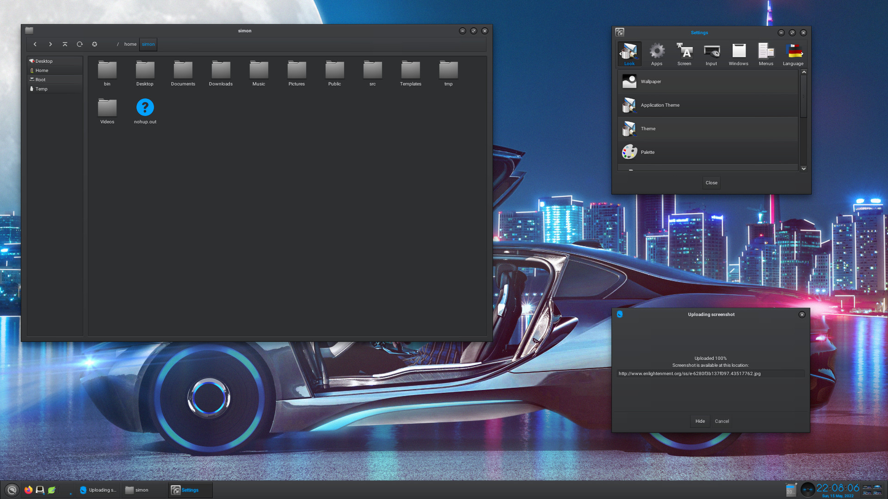  |  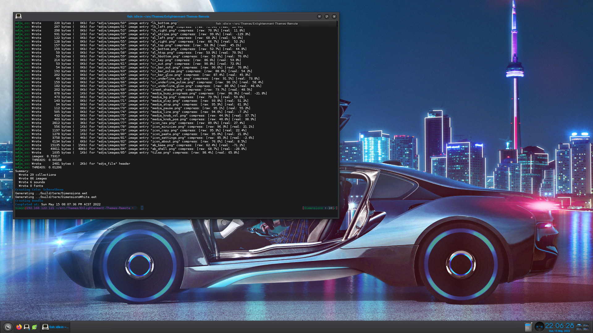  |

| **Dark** | | |
| :---: | :---: | :---: |
|    |  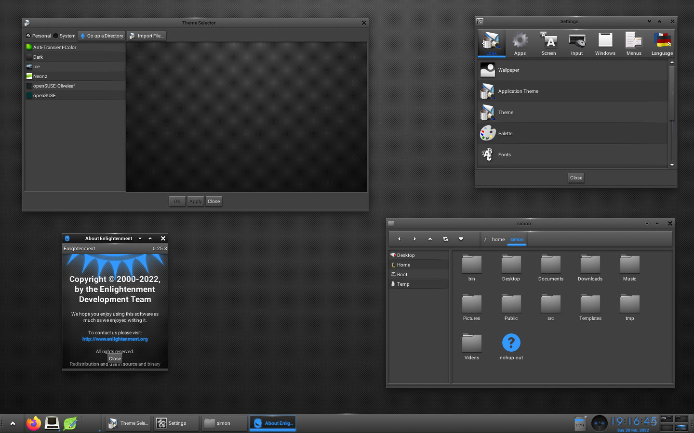  |  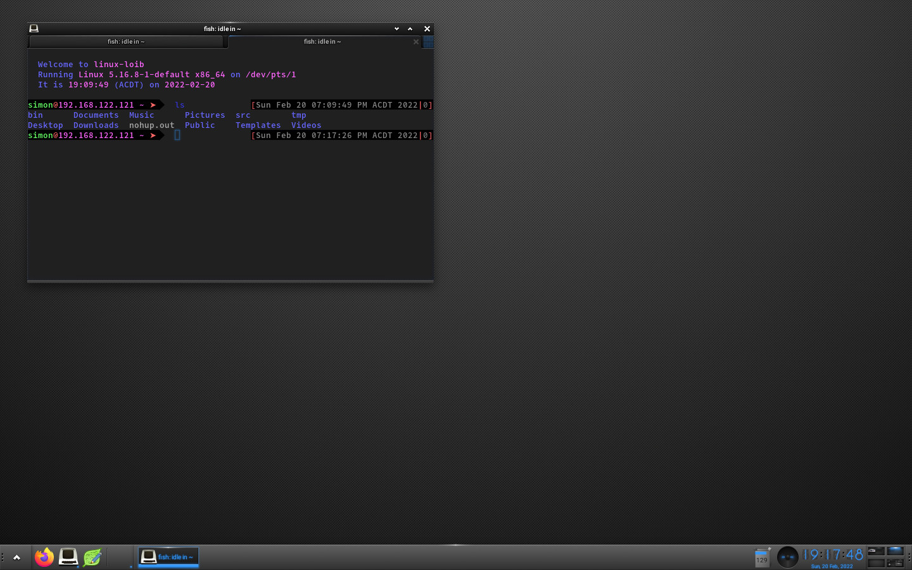  |

| **Ice** | | |
| :---: | :---: | :---: |
|  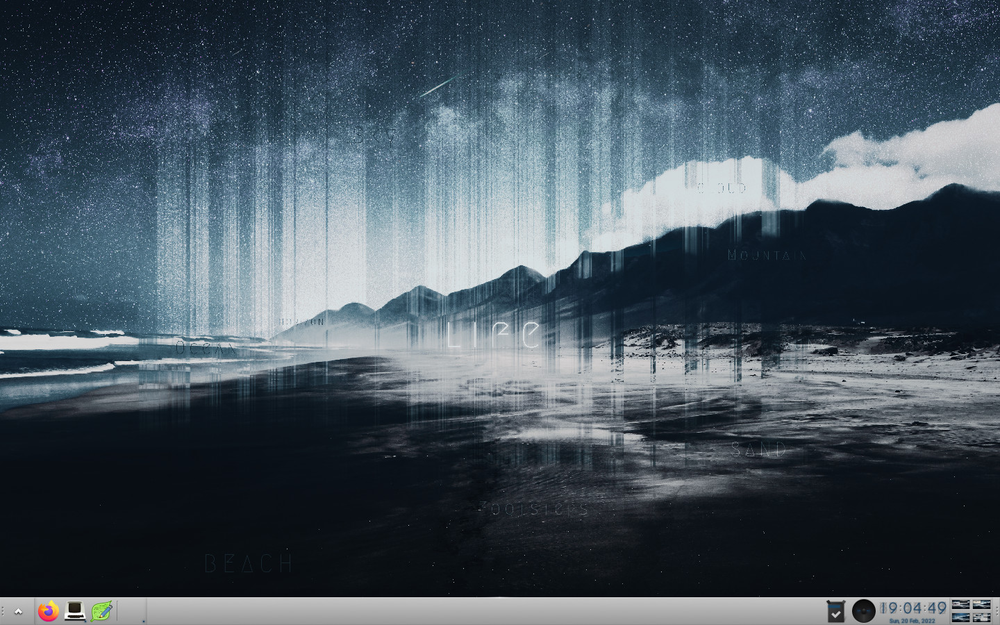  |  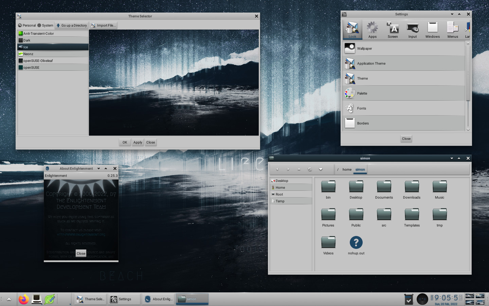  |  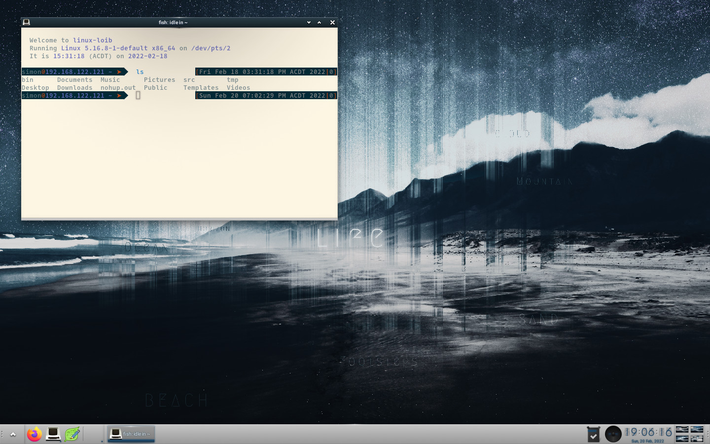  |

| **Neonz** | | |
| :---: | :---: | :---: |
|  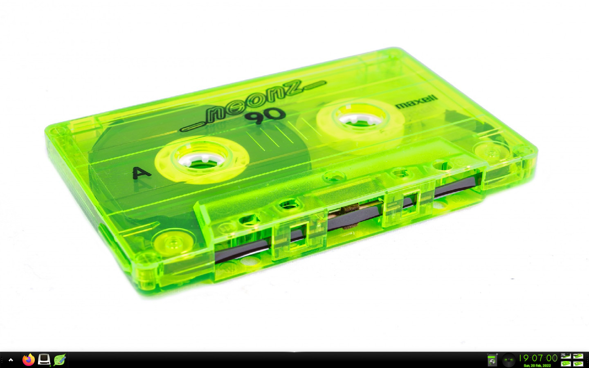  |  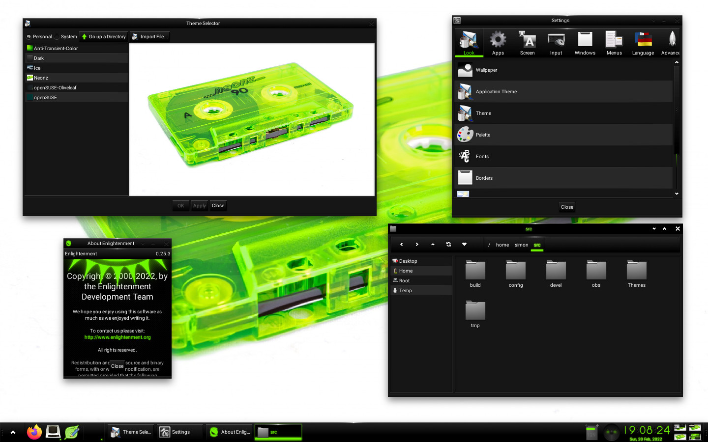  |  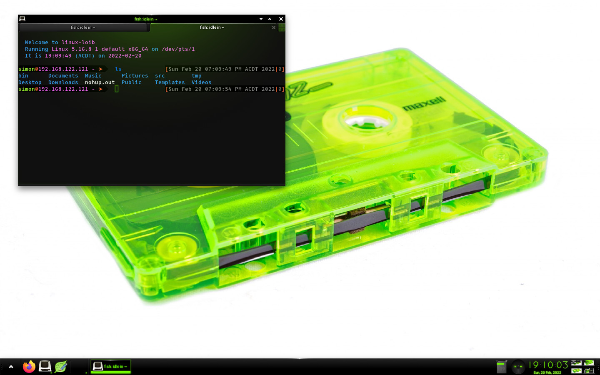  |

| **openSUSE-e-Oliveleaf** | | |
| :---: | :---: | :---: |
|    |  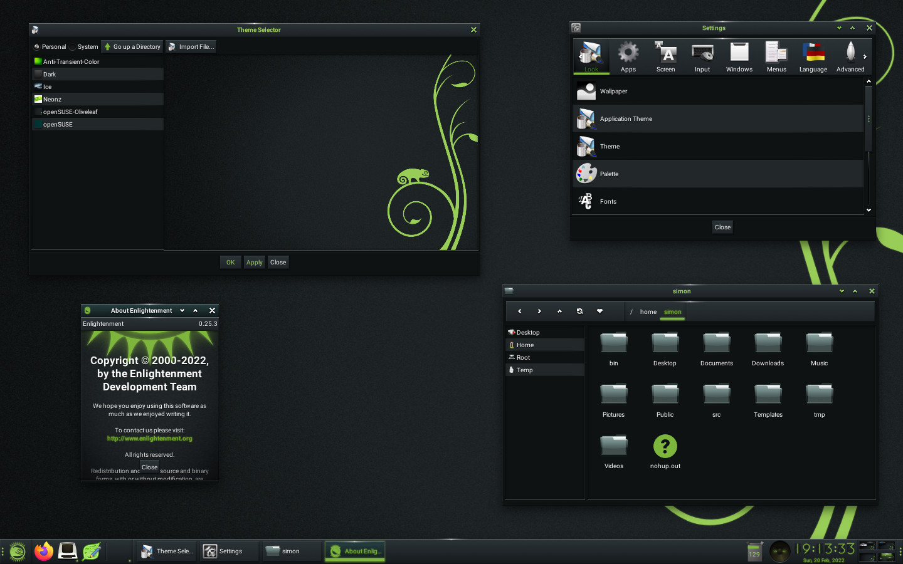  |  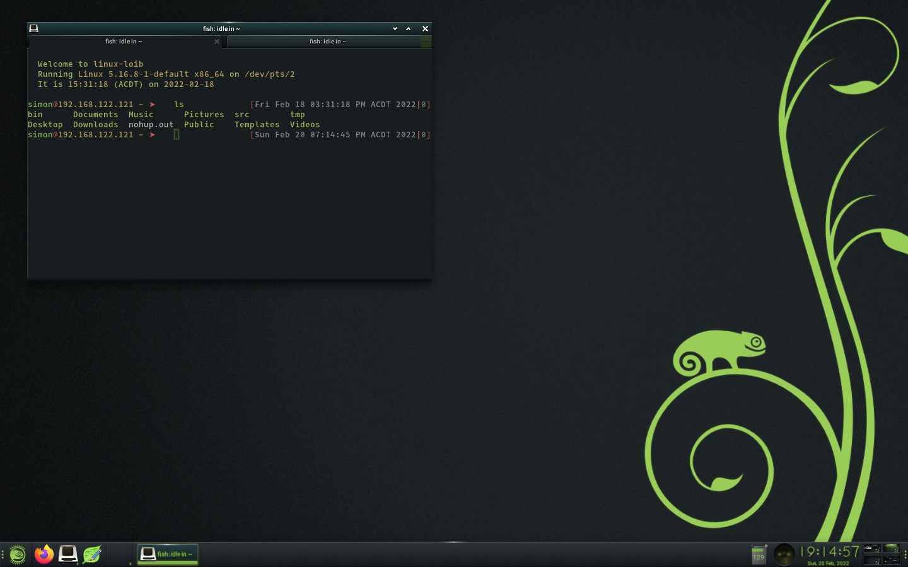  |

| **openSUSE-e-Dimensions** | | |
| :---: | :---: | :---: |
|  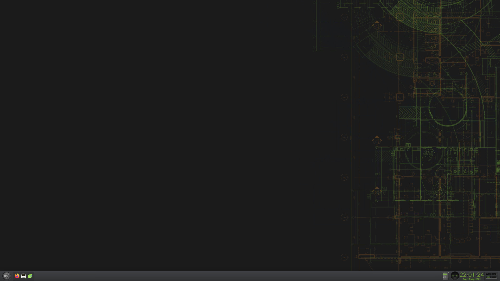  |    |  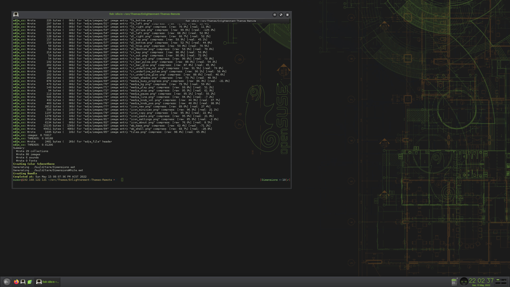  |
